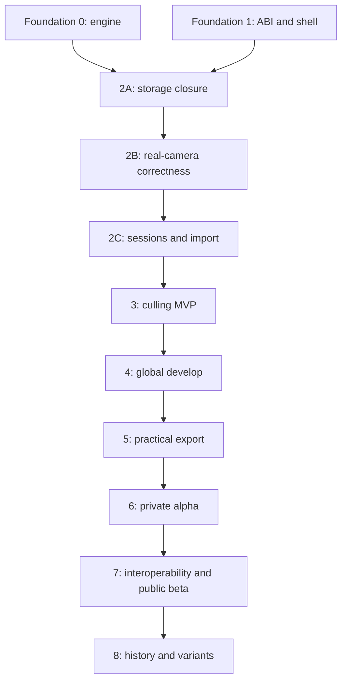

# banksia — product and engineering roadmap

> A product-first roadmap for a fast, local-first RAW culling and developing
> application in Zig, with portable sessions, robust storage, deterministic
> recipes, and a focused macOS interface.

**Status:** proposed canonical roadmap  
**Historical plans:** `plan.md` and `plan/phase-N/plan.md`  
**Detailed plans:** [`phases/`](phases/)  
**Compute strategy:** [`phases/compute-strategy.md`](phases/compute-strategy.md)  
**Primary target:** macOS on Apple Silicon

---

## Product target

Banksia is not initially trying to reproduce all of Capture One.

The first credible product is:

> A fast, keyboard-driven macOS workflow for importing, culling, globally
> developing, and exporting a shoot, with portable sessions, immutable
> originals, reliable recovery, and inspectable recipes.

The mandatory workflow is:

```text
Create or open a portable session
→ import a supported shoot without modifying the source
→ see thumbnails immediately
→ rate, reject, compare, and filter
→ make global adjustments
→ crop and straighten
→ export full-resolution and web JPEGs
→ close, reopen, verify, and repeat the export
```

The first useful release does not require broad Capture One parity, native
proprietary decoders, local brushes, automatic subject masks, broad tethering,
cloud sync, GPU-only rendering, printing, or complete Git semantics.

## Product success gate

Banksia reaches its first useful release when:

- a real supported shoot of at least 100 images is completed without another
  RAW editor;
- source files remain byte-identical;
- acknowledged imports and edits survive tested crash points;
- supported images have correct geometry, white balance, and baseline colour;
- cached culling is responsive on a 10,000-image session;
- full-resolution and web JPEG batches are delivered safely;
- a signed application runs without a development toolchain;
- session verification detects missing or corrupt data;
- camera and format limits are documented honestly.

---

## Current state

### Foundation Phase 0 — engine bootstrap

**Complete.** Native DNG/TIFF decode, strips and tiles, uncompressed CFA,
lossless JPEG, deterministic planar-f32 processing, canonical recipes, PNG/CLI
output, and a synthetic golden harness are implemented.

Current golden result: **20 pass, 0 fail**. These cases prove regression
stability, not real-camera colour correctness.

### Foundation Phase 1 — C ABI and inspection shell

**Complete.** The seven-function C ABI, C smoke test, debug leak gate, Swift
actor wrapper, SwiftUI sliders, and preview/full-resolution rendering are
implemented.

Recorded 24MP-class Apple Silicon results:

- warm edge-1024 preview: 116 ms;
- first edge-1024 preview: 283 ms;
- full-resolution render: 424 ms.

The current preview still renders at full resolution before downsampling.

### Foundation Phase 2 — storage primitives

**In progress.** The filesystem seam, BLAKE3 vault, seeded crash simulator,
explicit GC, FastCDC, and partial catalog/WAL/snapshot work exist.

The catalog is not yet test-clean, catalog mutations are not yet covered by the
crash simulator, and sessions/import/thumbnail scheduling do not exist.

---

## Roadmap

| Phase | Outcome | Detailed plan | Indicative solo duration |
|---|---|---|---:|
| 2A | Stable storage and catalog contract | [`phases/2a-storage-closure/plan.md`](phases/2a-storage-closure/plan.md) | 1–3 weeks |
| 2B | Correct real-camera DNG baseline | [`phases/2b-real-camera-correctness/plan.md`](phases/2b-real-camera-correctness/plan.md) | 4–8 weeks |
| 2C | Safe portable sessions and import | [`phases/2c-sessions-import/plan.md`](phases/2c-sessions-import/plan.md) | 4–7 weeks |
| 3 | Keyboard-driven culling MVP | [`phases/3-culling-mvp/plan.md`](phases/3-culling-mvp/plan.md) | 5–8 weeks |
| 4 | Baseline global develop | [`phases/4-global-develop/plan.md`](phases/4-global-develop/plan.md) | 6–10 weeks |
| 5 | Practical export; first completed shoot | [`phases/5-practical-export/plan.md`](phases/5-practical-export/plan.md) | 4–8 weeks |
| 6 | Product hardening and private alpha | [`phases/6-private-alpha/plan.md`](phases/6-private-alpha/plan.md) | 6–10 weeks |
| 7 | Interoperability, LibRaw, public beta | [`phases/7-interoperability-public-beta/plan.md`](phases/7-interoperability-public-beta/plan.md) | 6–12 weeks |
| 8 | Immutable history, variants, reproducibility | [`phases/8-history-variants/plan.md`](phases/8-history-variants/plan.md) | 5–9 weeks |



## Evidence-gated branches

These are not mandatory sequential phases. Each branch moves through
**Discover → Prove → Invest → Ship**, or is deliberately parked.

| Branch | Hypothesis | Plan |
|---|---|---|
| A | Smart grouping and focus assistance materially reduce culling time | [`phases/branch-a-smart-culling/plan.md`](phases/branch-a-smart-culling/plan.md) |
| B | Advanced processing lets a narrow camera set finish harder shoots | [`phases/branch-b-advanced-processing/plan.md`](phases/branch-b-advanced-processing/plan.md) |
| C | CPU optimization or Metal improves measured user-visible bottlenecks | [`phases/branch-c-performance-metal/plan.md`](phases/branch-c-performance-metal/plan.md) |
| D | One-camera tethering creates enough studio value to justify support | [`phases/branch-d-tethering/plan.md`](phases/branch-d-tethering/plan.md) |

---

## Compute position

Banksia should use parallelism, but in layers and only under one
memory-aware scheduler.

1. **Keep SIMD in hot kernels now.** It is local, deterministic, and already
   useful for per-pixel work.
2. **Use bounded asset-level parallelism first.** Thumbnail generation, metadata
   extraction, hashing, verification, and export naturally operate on independent
   photos.
3. **Keep catalog and WAL mutation single-writer.** Parallel preparation may
   feed one ordered commit path.
4. **Add intra-image tile threading after the real-camera reference path is
   stable.** Prove output invariance across thread counts and tile sizes.
5. **Avoid nested pools.** The global scheduler chooses between parallel photos
   and parallel tiles according to priority and memory budget.
6. **Keep a strict CPU renderer as the canonical backend.** It defines historical
   reproducibility and validates accelerated implementations.
7. **Use Metal only after CPU planning, cache reuse, and preview-resolution work
   still miss a measured interaction target.** Approximate GPU output receives a
   separate renderer/cache identity.

The detailed scheduler, queue, memory-token, cancellation, and GPU recommendations
are in [`phases/compute-strategy.md`](phases/compute-strategy.md).

---

## Planning rules

- Correctness before format or feature breadth.
- User workflows before infrastructure expansion.
- Stable contracts with replaceable implementations.
- Every phase has tests, workloads, measurable gates, risks, and non-goals.
- No silent recipe, renderer, session, or profile compatibility changes.
- Synthetic goldens prove determinism; real corpora prove photographic behavior.
- Performance claims use named hardware, corpus, build mode, and p50/p95/p99.
- Optional branches must pass evidence gates rather than become automatic scope.

Shared identity, durability, cache, validation, scoreboard, and close-out rules
live in [`phases/README.md`](phases/README.md).

## Immediate sequence

1. Finish and test the current catalog.
2. Correct validation and mutation acknowledgement semantics.
3. Extend crash simulation to catalog mutations and compaction.
4. Reconcile vault directory durability with the simulator model.
5. Restore `zig build test` to green.
6. Build the licensed real-camera DNG corpus.
7. Implement orientation, crop metadata, and baseline DNG colour.
8. Complete the LibRaw feasibility spike.
9. Implement portable sessions and bounded streaming import.
10. Build manual culling before smart-culling work.
