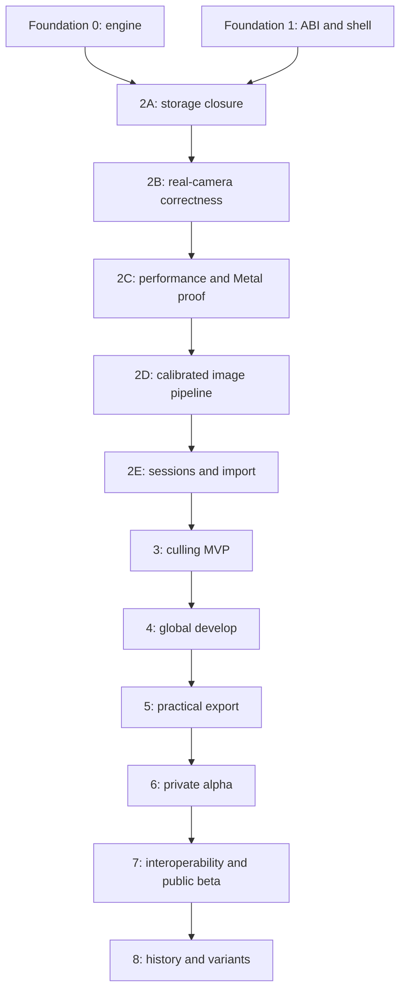

# banksia — product and engineering roadmap

> A product-first roadmap for a fast, local-first RAW culling and developing
> application in Zig, with portable sessions, robust storage, deterministic
> recipes, and a focused macOS interface.

**Status:** canonical roadmap  
**Detailed plans:** [`phases/`](phases/)  
**Compute strategy:** [`phases/compute-strategy.md`](phases/compute-strategy.md)  
**Primary target:** macOS on Apple Silicon

> This roadmap supersedes the original linear Phase 0–7 plan (removed; its
> history lives in git). Foundation Phases 0 and 1 landed under that
> structure and are complete; the next foundation work is split across
> 2A/2B/2C/2D/2E.

---

## Product target

Banksia is not initially trying to reproduce all of Capture One.

The first credible product is:

> A fast, keyboard-driven macOS workflow for importing, culling, globally
> developing, and exporting a shoot, with portable sessions, immutable
> originals, reliable recovery, and inspectable recipes.

The mandatory workflow is:

```text
Create or open a portable session
→ import a supported shoot without modifying the source
→ see thumbnails immediately
→ rate, reject, compare, and filter
→ make global adjustments
→ crop and straighten
→ export full-resolution and web JPEGs
→ close, reopen, verify, and repeat the export
```

The first useful release does not require broad Capture One parity, native
proprietary decoders, local brushes, automatic subject masks, broad tethering,
cloud sync, GPU-only rendering, printing, or complete Git semantics.

## Product success gate

Banksia reaches its first useful release when:

- a real supported shoot of at least 100 images is completed without another
  RAW editor;
- source files remain byte-identical;
- acknowledged imports and edits survive tested crash points;
- supported images have correct geometry, white balance, and baseline colour;
- cached culling is responsive on a 10,000-image session;
- full-resolution and web JPEG batches are delivered safely;
- a signed application runs without a development toolchain;
- session verification detects missing or corrupt data;
- camera and format limits are documented honestly.

---

## Current state

### Foundation Phase 0 — engine bootstrap

**Complete.** Native DNG/TIFF decode, strips and tiles, uncompressed CFA,
lossless JPEG, deterministic planar-f32 processing, canonical recipes, PNG/CLI
output, and a synthetic golden harness are implemented.

Current golden result: **25 pass, 0 fail**: 20 frozen engine-v1 cases and five
engine-v2 baseline-colour cases.

### Foundation Phase 1 — C ABI and inspection shell

**Complete.** The seven-function C ABI, C smoke test, debug leak gate, Swift
actor wrapper, SwiftUI sliders, and preview/full-resolution rendering are
implemented.

The initial shell still uses a synchronous CPU render, copies RGBA8 through
`Data`, constructs a `CGImage`, and computes display analysis on the CPU. Phase
2C measures and replaces that interaction boundary only when the end-to-visible
numbers prove the replacement.

### Foundation Phase 2A — storage closure

**Complete.** The vault/catalog crash simulator passed 10,000 workloads with
zero acknowledged loss. The 100,000-asset rating-plus-lens scan measured
0.140 ms and snapshot reopen measured 12.405 ms.

### Foundation Phase 2B — real-camera correctness

**Complete with a provisional permission-covered corpus.** Native DNG and
LibRaw-backed Canon CR2/CR3 files render through engine v2 with corrected
geometry, colour, white balance, and bounded clipped-highlight handling. The
mandatory corpus contains eight full-resolution DNG derivatives; the optional
local corpus covers 18 Canon RAWs and nine supported Apple LinearRaw files.

### Foundation Phase 2C — performance architecture and Metal proof

**Complete with recorded latency deviations.** Banksia now has explicit
CPU/GPU execution and surface ownership, a GPU-resident late-develop viewer,
strict CPU conformance/fallback, and a measured investment decision. Direct MSL
remains the normal path; its 47.758 ms p95 misses the original 33 ms target, so
presentation-driver investigation moves to Branch C rather than being hidden.

- [x] Record the seed CPU p50/p95/p99 baseline and render-stage signposts.
- [x] Define immutable requests, execution identities, image domains, and
  newest-generation-only publication.
- [x] Validate an on-demand two-drawable Metal surface with API validation.
- [x] Make on-demand Metal presentation the normal viewer path.
- [x] Run the Phase 2C inspection viewer GPU-only so CPU presentation cannot
  mask Metal initialization, processing, orientation, or command failures.
- [x] Restore and verify explicit strict-CPU fallback before the Phase 2C exit.
- [x] Retain a linear preview texture and move late develop operations onto it.
- [x] Record two early ≤33 ms runs and the final 47.758 ms p95 regression.
- [x] Complete CPU/Metal conformance, failure, resize/display, memory-pressure,
  idle-energy, and decision tests; record the remaining latency exceptions.

### Foundation Phase 2D — calibrated image pipeline

**Planned next.** Banksia will bootstrap a camera-, ISO-, and lens-aware default
pipeline from the extracted Capture One 16.7.3 calibration corpus, while keeping
camera colour, film curve, detail defaults, and optical correction as separate,
versioned dependencies. EOS-1D X Mark II and EOS R3 are the initial supported
camera profiles; the three Canon corpus lenses form the initial lens set.

The strict matrix renderer and every historical manifest remain available.
Later Banksia tuning creates new immutable calibration versions instead of
silently changing bootstrap results.

### Foundation Phase 2E — safe sessions and import

**Planned.** Portable sessions, bounded streaming import, provenance, resumable
ingest, and verification follow the calibrated renderer foundation.

---

## Roadmap

| Phase | Outcome | Detailed plan | Indicative solo duration |
|---|---|---|---:|
| 2A | Stable storage and catalog contract | [`phases/2a-storage-closure/plan.md`](phases/2a-storage-closure/plan.md) | 1–3 weeks |
| 2B | Correct real-camera DNG baseline | [`phases/2b-real-camera-correctness/plan.md`](phases/2b-real-camera-correctness/plan.md) | 4–8 weeks |
| 2C | Performance architecture and Metal proof | [`phases/2c-performance-metal/plan.md`](phases/2c-performance-metal/plan.md) | 2–4 weeks |
| 2D | Capture One–calibrated image pipeline foundation | [`phases/2d-calibrated-image-pipeline/plan.md`](phases/2d-calibrated-image-pipeline/plan.md) | 6–12 weeks |
| 2E | Safe portable sessions and import | [`phases/2e-sessions-import/plan.md`](phases/2e-sessions-import/plan.md) | 4–7 weeks |
| 3 | Keyboard-driven culling MVP | [`phases/3-culling-mvp/plan.md`](phases/3-culling-mvp/plan.md) | 5–8 weeks |
| 4 | Baseline global develop | [`phases/4-global-develop/plan.md`](phases/4-global-develop/plan.md) | 6–10 weeks |
| 5 | Practical export; first completed shoot | [`phases/5-practical-export/plan.md`](phases/5-practical-export/plan.md) | 4–8 weeks |
| 6 | Product hardening and private alpha | [`phases/6-private-alpha/plan.md`](phases/6-private-alpha/plan.md) | 6–10 weeks |
| 7 | Interoperability, LibRaw, public beta | [`phases/7-interoperability-public-beta/plan.md`](phases/7-interoperability-public-beta/plan.md) | 6–12 weeks |
| 8 | Immutable history, variants, reproducibility | [`phases/8-history-variants/plan.md`](phases/8-history-variants/plan.md) | 5–9 weeks |



## Evidence-gated branches

These are not mandatory sequential phases. Each branch moves through
**Discover → Prove → Invest → Ship**, or is deliberately parked.

| Branch | Hypothesis | Plan |
|---|---|---|
| A | Smart grouping and focus assistance materially reduce culling time | [`phases/branch-a-smart-culling/plan.md`](phases/branch-a-smart-culling/plan.md) |
| B | Advanced processing lets a narrow camera set finish harder shoots | [`phases/branch-b-advanced-processing/plan.md`](phases/branch-b-advanced-processing/plan.md) |
| C | Deeper measured acceleration extends the Phase 2C proof | [`phases/branch-c-performance-metal/plan.md`](phases/branch-c-performance-metal/plan.md) |
| D | One-camera tethering creates enough studio value to justify support | [`phases/branch-d-tethering/plan.md`](phases/branch-d-tethering/plan.md) |

---

## Compute position

Banksia should use parallelism, but in layers and only under one
memory-aware scheduler.

1. **Keep SIMD in hot kernels now.** It is local, deterministic, and already
   useful for per-pixel work.
2. **Use bounded asset-level parallelism first.** Thumbnail generation, metadata
   extraction, hashing, verification, and export naturally operate on independent
   photos.
3. **Keep catalog and WAL mutation single-writer.** Parallel preparation may
   feed one ordered commit path.
4. **Add intra-image tile threading after the real-camera reference path is
   stable.** Prove output invariance across thread counts and tile sizes.
5. **Avoid nested pools.** The global scheduler chooses between parallel photos
   and parallel tiles according to priority and memory budget.
6. **Keep a strict CPU renderer as the canonical backend.** It defines historical
   reproducibility and validates accelerated implementations.
7. **Use Phase 2C to prove a narrow GPU-resident interaction path now.** Keep
   strict CPU canonical, count transfers and traversals, and give approximate
   GPU output a separate renderer/cache identity.

The detailed scheduler, queue, memory-token, cancellation, and GPU recommendations
are in [`phases/compute-strategy.md`](phases/compute-strategy.md).

---

## Planning rules

- Correctness before format or feature breadth.
- User workflows before infrastructure expansion.
- Stable contracts with replaceable implementations.
- Every phase has tests, workloads, measurable gates, risks, and non-goals.
- No silent recipe, renderer, session, or profile compatibility changes.
- Synthetic goldens prove determinism; real corpora prove photographic behavior.
- Performance claims use named hardware, corpus, build mode, and p50/p95/p99.
- Optional branches must pass evidence gates rather than become automatic scope.

Shared identity, durability, cache, validation, scoreboard, and close-out rules
live in [`phases/README.md`](phases/README.md).

## Immediate sequence

1. Instrument the CPU-to-visible render path with p50/p95/p99 and memory data.
2. Define backend-independent render domains, ownership, and execution IDs.
3. Prove an on-demand Metal surface and GPU-resident late-develop slice.
4. Compare Metal against strict CPU across the Phase 2B corpus and failure paths.
5. Record the Phase 2C invest/park decision from end-to-visible evidence.
6. Implement the Phase 2D calibrated camera/ISO/lens pipeline.
7. Implement Phase 2E portable sessions and bounded streaming import.
8. Build manual culling before smart-culling work.
